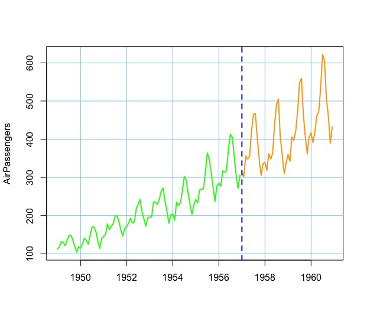
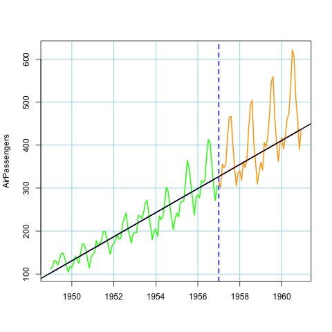

# Time Series Analysis of `AirPassengers` Dataset using `R`

## By Sourish Das
#### Chennai Mathematical Institute

*Sourish is Associate Professor at Chennai Mathematical Institute (CMI). He did his PhD from the University of Connecticut and his postdoc at Duke University. Then he worked in SAS for three years before joining CMI. For the last ten years, he has been faculty at CMI.*

<p align = "center">

</p>

### Introduction

In this case study, we will present the time-series analysis of the `AirPassengers` Dataset using `R`. The data is classic Box & Jenkins (1976) airline data. The dataset consists of univariate time-series data about the number of passengers flying per month from 1949 to 1960 in the US. This time-series dataset addresses the issue of trend, seasonality, and exponential growth. Here we will present how we can model such time series data step-by-step. Note that the dataset is available in the `datasets` package of `R`.

### Data Set

First, we will look at the dataset itself as it is. The dataset is stored as `Time-Series` object and we present it as simple 

```R
> str(AirPassengers)
 Time-Series [1:144] from 1949 to 1961: 112 118 132 129 121 135 148 148 136 119 ...

> AirPassengers
     Jan Feb Mar Apr May Jun Jul Aug Sep Oct Nov Dec
1949 112 118 132 129 121 135 148 148 136 119 104 118
1950 115 126 141 135 125 149 170 170 158 133 114 140
1951 145 150 178 163 172 178 199 199 184 162 146 166
1952 171 180 193 181 183 218 230 242 209 191 172 194
1953 196 196 236 235 229 243 264 272 237 211 180 201
1954 204 188 235 227 234 264 302 293 259 229 203 229
1955 242 233 267 269 270 315 364 347 312 274 237 278
1956 284 277 317 313 318 374 413 405 355 306 271 306
1957 315 301 356 348 355 422 465 467 404 347 305 336
1958 340 318 362 348 363 435 491 505 404 359 310 337
1959 360 342 406 396 420 472 548 559 463 407 362 405
1960 417 391 419 461 472 535 622 606 508 461 390 432

> plot(AirPassengers,lwd=2)
```
<figure>
<p align = "center">

</p>
<p align = "center">Figure 1: Simple time series plot of AirPassengers data</p>
</figure>


In the following we present a simple time series modeling using the **statistical linear model** framework.

### Modeling Approach

There are two issues to consider. First, what model fits the data? Then the second issue is how to test if the model is doing a reasonable job or not. We will fit several models. However, we will compare each model on the same test dataset and train them with same dataset. So we split the dataset into train and test. Out of 12 years of data, we consider first eight years of the data as training data and latest four years of the data as test data. So first we split the data accordingly using the following `R` code.

```R
> AirP_data = data.frame(cbind(time = time(AirPassengers),AirPassengers=AirPassengers))
> n=nrow(AirP_data)
> n ## number all data points 
[1] 144
> m=12*8 ## number of data points for taining data
> m
[1] 96

## Create a column marking first 8 years of data as tain and last four years of data as test
> AirP_data$train_test=c(rep('train',length.out=m), rep('test',length.out=(n-m)))


> head(AirP_data)
      time AirPassengers train_test
1 1949.000           112      train
2 1949.083           118      train
3 1949.167           132      train
4 1949.250           129      train
5 1949.333           121      train
6 1949.417           135      train

> tail(AirP_data)
        time AirPassengers train_test
139 1960.500           622       test
140 1960.583           606       test
141 1960.667           508       test
142 1960.750           461       test
143 1960.833           390       test
144 1960.917           432       test

## split the data into train and test
> AirP_data_train = AirP_data[AirP_data$train_test=='train',]
> AirP_data_test = AirP_data[AirP_data$train_test=='test',]

> plot(NULL,xlim=c(min(AirP_data$time),max(AirP_data$time))
         ,ylim=c(min(AirP_data$AirPassengers),max(AirP_data$AirPassengers))
         ,xlab = ''
         ,ylab = 'AirPassengers')
> grid(col='skyblue',lty=1)
> lines(AirP_data_train$time, AirP_data_train$AirPassengers
     ,lwd=2,col='green')
> lines(AirP_data_test$time, AirP_data_test$AirPassengers
      ,col='orange',lwd=2)
> abline(v=1957,col='blue',lty=2,lwd=2)
```

<figure>
<p align = "center">

</p>
<p align = "center">Figure 2: From 1949 to 1956 (marked as green) used as training data and from 1957 to 1960 (marked as orange) is used for testing the model predictions.</p>
</figure>

**Model 1**: First model we try the simple linear regression over time. That is

$$
y(t) = \alpha + \beta t + \varepsilon(t),
$$

where $\varepsilon(t)\sim N(0,\sigma^2)$. We used `lm` in `R` to fit the model.

```R
> fit1 = lm(AirPassengers ~ time
+           ,data = AirP_data_train)
> summary(fit1)

Call:
lm(formula = AirPassengers ~ time, data = AirP_data_train)

Residuals:
    Min      1Q  Median      3Q     Max 
-63.239 -18.529  -2.838  17.138 100.066 

Coefficients:
              Estimate Std. Error t value Pr(>|t|)    
(Intercept) -54501.445   2663.697  -20.46   <2e-16 ***
time            28.017      1.364   20.54   <2e-16 ***
---
Signif. codes:  0 ‘***’ 0.001 ‘**’ 0.01 ‘*’ 0.05 ‘.’ 0.1 ‘ ’ 1

Residual standard error: 30.86 on 94 degrees of freedom
Multiple R-squared:  0.8178,	Adjusted R-squared:  0.8159 
F-statistic: 421.9 on 1 and 94 DF,  p-value: < 2.2e-16
```

As we fit the **Model 1** with `lm`, the `summary` shows that 81.78\% of variability of training data is getting explained by the simple straight line which is explaining the trend in the data. However we should see its performance in test data.


```R
## Predict in test data
> AirP_data_test$pred = predict(fit1,newdata = AirP_data_test)
> lines(AirP_data_test$time,AirP_data_test$pred,col='red',lty=1,lwd=2)
> lines(AirP_data_train$time,fit1$fitted.values,col='blue',lty=1,lwd=2)

## Check the preformance of the prediction in test data.
## Out sample R-square
> cor(AirP_data_test$AirPassengers,AirP_data_test$pred)^2
[1] 0.3103215

## In sample R-square
> cor(AirP_data_train$AirPassengers,fit1$fitted.values)^2
[1] 0.8178068

## Out sample RMSE
> sqrt(mean((AirP_data_test$AirPassengers-AirP_data_test$pred)^2))
[1] 72.6894

## In sample RMSE
> sqrt(mean((AirP_data_train$AirPassengers-fit1$fitted.values)^2))
[1] 30.53734
```
We combine the prediction performance in train and test data in the **Table 1**.

Models   | R-Sqr (In-sample) | R-Sqr (Out-sample) | RMSE (In-sample) | RMSE (Out-sample)
-------- | ----------------- | -------------------|------------------|------------------
Model 1  | 0.8178            | 0.3103             | 30.54            | 72.69

<p align = "left"><b>Table 1</b>: Performance of Model 1. We consider R-square and RMSE for both train and test data. Though Model 1 is perhaps the simplest. Is the model overfitting? Or underfitting?</p>

In Table 1, we presented the performance of Model 1. Though Model 1 is perhaps the simplest, the model is overfitting, as performance is inferior in the test data. Generally, this does not happen if train and test data are similar. However, the train and test data here are markedly different! We considered R-square and RMSE for both train and test data. Figure 3 visually represents the performance of **Model 1**. Clearly, the variability in the test dataset is higher due to the peak season in summer, particularly in the month of July. The **Model 1** fails to capture the highs of summer. Next we introduce the quadratic trend.

<figure>
<p align = "center">

</p>
<p align = "center">Figure 3: Fitted simple line over train data, described in Model 1.</p>
</figure>

**Model 2**: We try consider the quadratice regression over time. That is

$$
y(t) = \alpha + \beta t + \gamma t^2 +\varepsilon(t),
$$

where $\varepsilon(t)\sim N(0,\sigma^2)$. We used `lm` in `R` to fit the model.


## Referances:

[1] Box, G. E. P., Jenkins, G. M. and Reinsel, G. C. (1976) Time Series Analysis, Forecasting and Control. Third Edition. Holden-Day. Series G.

